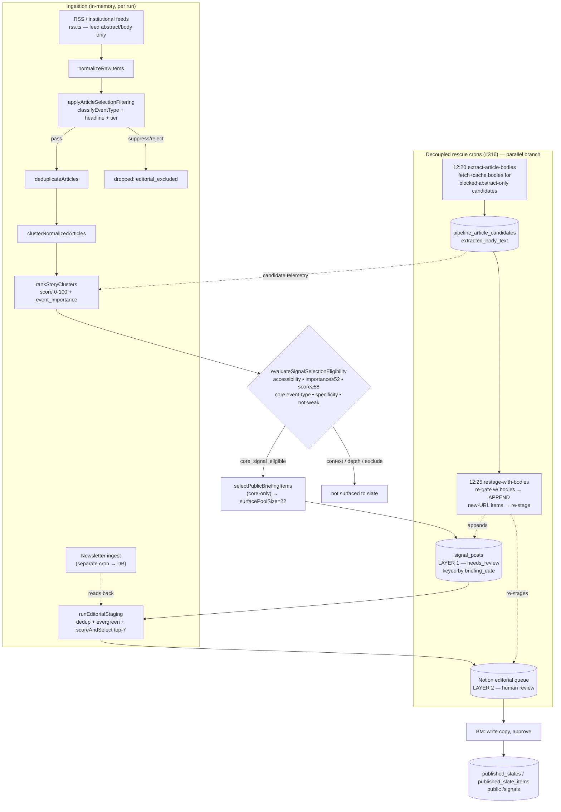

# Boot Up — Canonical Pipeline Architecture

> **Status:** Factual documentation of the system as it exists today. This is **not** a design
> document — it describes the pipeline, not a proposed redesign (§H maps fragility as input to a
> *separate* design pass).
>
> **Canonical code state:** git worktree `crazy-hypatia-5c93e3` at HEAD **`066274e`**
> (`feat(extraction): decoupled article-body extraction + same-cycle restage (#316)`). All `file:line`
> citations are against this tree.
> ⚠️ The sibling working copy at `/Users/bm/dev/bootupnews` is checked out at **`b8faf25` (PRD-53,
> pre-#312)** and is missing #312–#317 — do not cite it.
>
> **Production:** Supabase project `fwkqjeumreaznfhnlzev`. All data in this doc came from **read-only
> SELECT** queries run on production.
>
> **Diagnosis tags** (per AGENTS.md §14): `[verified: file:line]` = read directly from code;
> `[inferred]` = derived, not directly stated; `[live≠repo]` = production behavior or state diverges
> from what the code implies. Load-bearing predicates are pasted verbatim, not paraphrased.

---

## §A. System Overview

Boot Up turns a fixed set of RSS/institutional feeds (plus benchmark newsletters) into a **human-reviewed
daily slate of "signals."** Once a day a cron pulls every feed, normalizes the items, runs a quality
filter, deduplicates, clusters near-duplicate coverage into one story, ranks each cluster, and then
runs each cluster through a **multi-gate eligibility evaluator**. Only clusters that earn the
`core_signal_eligible` tier are written to `signal_posts` (the layer-1 editorial store) at
`editorial_status = needs_review`; from there a staging step pushes a curated subset into a **Notion
editorial queue** (layer-2) where a human (BM) writes/approves the editorial copy and publishes the
public slate. Two **decoupled follow-on crons** (added in #316) try to rescue stories that the
accessibility gate blocked for thin text: one fetches and caches full article bodies, the second
re-gates the day with those bodies and *appends* any newly-eligible stories to the same day's slate.



The pipeline run also persists per-article telemetry to `pipeline_article_candidates` (the candidate
pool / observability table) so the funnel is queryable after the fact `[verified:
src/lib/pipeline/index.ts:63-77]`.

---

## §B. Trigger / Cron Topology

Six cron routes exist under `src/app/api/cron/` `[verified: directory listing]`. Every route is `GET`,
returns **HTTP 202 immediately**, and runs its real work asynchronously via Next's `after()` so the
caller (cron-job.org) never waits. Auth is a shared `x-cron-secret` header check `[verified:
src/lib/cron/cron-endpoint-runtime.ts:35-50]`:

```ts
export function isCronAuthorized(request: Request): boolean {
  const cronSecret = process.env.CRON_SECRET?.trim();
  if (!cronSecret) return false;
  const headerSecret = request.headers.get("x-cron-secret")?.trim() ?? "";
  if (headerSecret === cronSecret) return true;
  if (process.env.ALLOW_VERCEL_CRON_FALLBACK === "true") { /* Bearer fallback */ }
  return false;
}
```

(The `health` route carries its own inline copy of the same logic rather than importing it `[verified:
src/app/api/cron/health/route.ts:41-55]`.)

### Repo cron config vs live state

| # | Job / route | Schedule (UTC) | What it runs | maxDuration | In `cron-jobs.config.ts`? | Live on cron-job.org? |
|---|---|---|---|---|---|---|
| 1 | `ingest-newsletters` | **~11:50** (doc comment only) | Gmail → `newsletter_emails` + `newsletter_story_extractions` | none | **NO** | **YES** `[live≠repo]` |
| 2 | `fetch-editorial-inputs` (main) | **12:00** | RSS pipeline → `signal_posts` → Notion staging | 60s | yes (`:52-60`) | yes |
| 3 | `health` | **12:15** | Assert Notion queue ≥7 rows / ≥5 sources | none | yes (`:65-73`) | yes |
| 4 | `extract-article-bodies` (CRON-1) | **12:20** | Fetch+cache bodies for blocked candidates | 60s | yes (`:81-89`) | yes |
| 5 | `restage-with-bodies` (CRON-2) | **12:25** | Re-gate w/ bodies → append → re-stage | 60s | yes (`:96-104`) | yes |
| 6 | `sweep` | unscheduled in config | `needs_review` TTL sweep (idempotent UPDATE) | none | **NO** | **YES (duplicate title)** `[live≠repo]` |

`[verified: scripts/cron-jobs.config.ts]` for repo config; `[verified: vercel.json:2-12]` for maxDuration.

**Execution order of the daily cycle** `[inferred from schedules + route headers]`:
`11:50 newsletter` → `12:00 main ingestion` → `12:15 health` → `12:20 extract` → `12:25 restage`,
with `sweep` running independently. The newsletter leg **must** precede the main leg because the main
leg's staging reads newsletter rows back from the DB `[verified: src/app/api/cron/ingest-newsletters/route.ts:31-33 doc]`.

### Timeout budgets `[verified]`

- `INTERNAL_STAGE_TIMEOUT_MS = 55_000` — the internal wall, ~5s below Vercel's 60s ceiling
  `[src/lib/cron/cron-endpoint-runtime.ts:32]`. Used by `fetch-editorial-inputs` and `sweep`.
- `RUN_LOCK_STALE_MS = 70_000` — when a `running` lock is considered stale and reclaimable
  `[src/app/api/cron/fetch-editorial-inputs/route.ts:51]`.
- `maxDuration: 60` for the three routes above only `[vercel.json]`.

### Divergences flagged `[live≠repo]`

1. **`ingest-newsletters` is absent from `cron-jobs.config.ts`** but is firing in production — proven by
   live data: `newsletter_emails` = 92 rows, `newsletter_story_extractions` = 429 rows `[verified:
   list_tables]`. The 11:50 UTC time exists only in a route doc comment, not in any committed schedule.
2. **`sweep` is absent from `cron-jobs.config.ts`** and (per the project's standing operations note) is
   present on cron-job.org **with a duplicate title that collides with the ingestion job** — i.e. the
   sweep job is mislabeled. The cron-job.org live state **cannot be queried from this environment** (no
   cron-job.org API access), so this is asserted from the operations record + the route's existence,
   not directly observed. `[live≠repo, partially unverifiable]`
3. **Run reliability** — the scheduled 12:00 runs have been *failing*. `cron_runs` shows `timeout` on
   2026-06-05/06-06 and `fail` on 2026-05-28 → 2026-06-04; the only `ok` runs in the recent window are
   **off-cycle manual runs** (2026-06-08 04:43, 2026-06-09 16:04) `[verified: cron_runs SELECT]`. So
   "the cron runs daily at 12:00 and succeeds" is contradicted by production. `[live≠repo]`
4. **`ingest-newsletters`, `sweep`, `health` have no `maxDuration` override** — they fall back to the
   Vercel project default. If that default is below ~55s, the `after()` work can be killed before the
   internal stage timeout fires. The project default is not verifiable from code. `[inferred]`
5. **Stale comment:** `fetch-editorial-inputs/route.ts:47` references a non-existent
   `INTERNAL_PIPELINE_TIMEOUT_MS`; the real constant is `INTERNAL_STAGE_TIMEOUT_MS`. `[verified]`

### Idempotency

Only `fetch-editorial-inputs` holds the **run lock**: it inserts a `cron_runs` row keyed by
`briefing_date` alone (PK), so only one endpoint per day can own it; PK conflict (`23505`) →
inspect existing row → `already_completed` / `in_progress` / reclaim-if-stale `[verified:
src/app/api/cron/fetch-editorial-inputs/route.ts:109-198]`. Every other cron is lock-free and relies on
its own idempotent write (newsletter: `gmail_message_id` unique index; extraction: `extraction_status
IS NULL` re-selection; restage: URL-keyed append; sweep: idempotent UPDATE).

---

## §C. Component-by-Component Logic

The orchestrator is `runClusterFirstPipeline` `[verified: src/lib/pipeline/index.ts:28-174]`. Stage order:

```
ingestRawItems (43) → normalizeRawItems (59) → applyArticleSelectionFiltering (60)
  → deduplicateArticles (62) → clusterNormalizedArticles (63) → rankStoryClusters (64)
```
`[verified: src/lib/pipeline/index.ts:43-64]`. **Note the order:** the quality filter runs *before*
dedup and clustering; the multi-gate **eligibility** evaluation runs *later*, in
`generateDailyBriefing` (§C.7).

### C.1 Ingestion → `rss.ts` + `ingestion/index.ts`

The base RSS ingest reads **only what the feed XML carries** — it does **not** fetch article pages
`[verified: src/lib/rss.ts:308-332]`:

```ts
contentText: stripHtml(encodedContent || itemContent || ""),   // body source
summaryText: stripHtml(itemSnippet || itemContent || itemSummary || item.title || ""),
```

If a feed ships only a `<description>`, `contentText` is the **empty string** (description only feeds
`summaryText`). No body fetch, no length cap beyond `items.slice(0, 15)` per feed `[verified:
src/lib/rss.ts:295]`. This is the structural root of the accessibility bias (§G/§H).

`ingestRawItems` builds per-article accessibility diagnostics via `buildArticleSourceAccessibility`
`[verified: src/lib/pipeline/ingestion/index.ts:20,266]`. When the decoupled extraction map is passed
in, it merges with a **longer-of rule** — the extracted body overrides `contentText` only when it is
longer `[verified: src/lib/pipeline/ingestion/index.ts:256-263]`:

```ts
const nativeContent = entry.article.contentText ?? "";
const extractedBody = extractedBodyByCanonicalUrl?.get(canonicalUrlKey(entry.article));
... extractedBody && extractedBody.length > nativeContent.length
      ? { ...entry.article, contentText: extractedBody } : entry.article
```

**Reads:** live feeds. **Writes:** in-memory `RawItem[]`; nothing to DB at this stage.

### C.2 Normalization / dedup

`normalizeRawItems` produces `NormalizedArticle[]`. `deduplicateArticles` runs **after** the quality
filter. The candidate-table observability also computes its own dedup reasons: exact normalized-URL
match → `duplicate_url`; title Jaccard `>= 0.82` → `duplicate_title` `[verified:
src/lib/pipeline/article-candidates.ts:194-208]`.

### C.3 Article quality filter → `signal-filtering.ts`

`applySignalFiltering` classifies each article and returns `pass | suppress | reject` `[verified:
src/lib/signal-filtering.ts:158-330]`. Three sub-classifiers: `classifySourceTier` (tier1/2/3/unknown),
`classifyHeadlineQuality` (strong/medium/weak via the `STRONG_/WEAK_HEADLINE_PATTERNS` scorecards), and
`classifyEventType`. Decision matrix highlights `[verified: src/lib/signal-filtering.ts:188-329]`:
`HARD_BLOCK_EVENT_TYPES` → reject; `SOFT_BLOCK_EVENT_TYPES` → suppress (reject if tier3/weak);
tier1+strong → pass; tier2+medium+high-priority → pass. A **low-volume fallback** promotes suppressed
items to pass when fewer than `minPassCount = 4` pass in the 48h window `[verified:
src/lib/signal-filtering.ts:71-74, 399-435]`.

**#315 changed `classifyEventType`** (`fix(signals): classifyEventType stops blocking genuine news and
promoting weak items`) `[verified: src/lib/signal-filtering.ts:363-417]`. The classifier scans
`` `${topicName} ${title} ${summaryText}` `` `[verified: :366-368]` — i.e. it reads body/summary text,
not just the headline. #315's additions:

- Opinion-frame markers tightened/expanded `[verified: :374]`:
  ```
  /\b(opinion|editorial|op-ed|making us (lose|dumber|smarter|sicker|poorer|anxious|stupid)|
     lose control of (our|your)|the case (for|against)|why you should|is it time to|
     in (defense|praise) of|a love letter to|we need to talk about|i'?ve been (at|to)|
     i sat down with|in my (view|opinion))\b/
  ```
- Profile-speculation → `opinion_only` (`what does X want now/next`) `[:377]`.
- Process/gossip framing → `generic_commentary` `[:386]`.
- Legislative action → `policy_regulation` (bills passing even without "policy"/"regulation") `[:403]`.
- Expanded `cybersecurity_enforcement` (with a breach-context second clause) `[:393-398]` and
  `macro_market_move` (sell-off/rout) `[:413]`.

The §H fragility here: the opinion regex matches anywhere in title **or summary body**, so a hard-news
item whose abstract happens to contain "the case for…" or "we need to talk about" can be mis-typed
`opinion_only` and hard-blocked.

### C.4 Clustering → `clusterNormalizedArticles`

Groups near-duplicate coverage into one `StoryCluster` (in-memory; the live `story_clusters` /
`story_cluster_members` tables are **0 rows** `[verified: list_tables]` — clustering is not persisted to
those tables). One representative article is chosen per cluster.

### C.5 Ranking → `scoring-engine.ts` + donor importance provider

Final `score` (0-100) is **not** a flat bucket sum. Three grouped buckets are weighted `[verified:
src/lib/scoring/scoring-engine.ts:35-39]`:

```ts
const GROUP_WEIGHTS = { trust_timeliness: 0.34, event_importance: 0.42, support_and_novelty: 0.24 };
```

Each bucket is a weighted blend of sub-features `[verified: :205-239]`; the grouped score is then
**blended 0.38 legacy / 0.62 grouped** plus importance adjustments plus a diversity delta `[verified:
:265-316, :414]`.

### C.6 Importance scoring → `event_importance` (the ≥52 gate input)

`event_importance` = `groupedScores.event_importance` `[verified:
src/lib/signal-selection-eligibility.ts:305]`, the weighted blend of six **structural features**
computed by keyword-presence over the cluster corpus in the importance feature-provider `[verified:
src/adapters/donors/registry.ts:719-937]`. **There is no static `event_type → importance` table** —
importance is corpus-driven.

**#312 (PRD-38) recalibration** `[verified: src/adapters/donors/registry.ts:45-53 diagnosis comment]`
added three corpus boosts and one penalty, because the old vocab scored Fed/research explainers high
(58-88) while interstate-conflict / major-legislation floored (~20-27) — an inversion:

- Interstate-conflict boost `[:870-873]`; major-legislation/regulatory-action boost `[:878-887]`.
- **Evergreen penalty −48 to every feature** `[:903-921]`:
  ```ts
  if (evergreenVerdict.isEvergreen) { const p = -48; addCalibrationBoost({ structural: p, ... }); }
  ```

**#313** added a magnitude-gated business/markets boost (≥$500M or mega-cap actor + action)
`[:889-901, :135-139]`.

A separate diversity provider penalizes colliding clusters by −1.5 to −6 depending on importance
`[verified: src/adapters/donors/registry.ts:620-681]`.

### C.7 Source-accessibility gate → `source-accessibility.ts`

The thresholds (char counts) `[verified: src/lib/source-accessibility.ts:16-23]`:

```ts
const FULL_TEXT_THRESHOLD = 1_200;
const SUBSTANTIAL_PARTIAL_THRESHOLD = 500;
export const SUBSTANTIAL_ABSTRACT_THRESHOLD = 800;   // exported in #316 for the extractor
const CONTEXT_PARTIAL_THRESHOLD = 300;
const CONTEXT_ABSTRACT_THRESHOLD = 500;
const DEPTH_TEXT_THRESHOLD = 120;
```

`evaluateSourceAccessibilitySupport` derives `coreSupported / contextSupported / depthSupported` from a
cluster's per-article diagnostics. `coreSupported` is the binding gate `[verified: :501]`:

```ts
const coreSupported = fullTextCore || substantialPartialCore || substantialAbstractCore || corroboratedPartialCore;
```

where `fullTextCore` needs `full_text_available` (≥1200 chars) from a core-supporting role; the
abstract path needs ≥800 chars; and `corroboratedPartialCore` needs ≥2 authoritative partial sources
summing ≥800 chars `[verified: :337-355, :483-501]`. Core-supporting roles are
`primary_authoritative / secondary_authoritative / context_authority / primary_institutional`
`[verified: :49-54]`. Paywall hosts (`ft.com, bloomberg.com, wsj.com, economist.com,
theinformation.com, stratechery.com, puck.news, foreignaffairs.com, marketwatch.com`) get
`paywall_limited` below 500 chars `[verified: :25-35, :179]`.

### C.8 Eligibility / tier assignment → `signal-selection-eligibility.ts`

`evaluateSignalSelectionEligibility` assigns each cluster a tier. The **core gate** (paste verbatim)
`[verified: src/lib/signal-selection-eligibility.ts:346-357]`:

```ts
const coreEligible =
  filterDecision === "pass" &&
  !fallbackPromoted &&
  sourceQualityAdequate &&
  sourceAccessibility.coreSupported &&
  specific &&
  !weakContent &&
  !routineOrStaleRelease &&
  !ceremonialOrLowPolicyChange &&
  (structuralEventType || strongStructuralOverride) &&
  structuralImportanceScore >= 52 &&
  ranked.score >= 58;
```

`structuralEventType` = `CORE_EVENT_TYPES.has(eventType)` `[verified: :312, :13-30]` where `eventType`
prefers the **filter** classifier (`articleFilterEvaluation.eventType`) over event-intelligence
`[verified: :292]`. Looser tiers: **context** needs `contextSupported`, importance ≥46, score ≥52
`[verified: :359-370]`; **depth** needs `depthSupported`, importance ≥44 OR score ≥50 OR ≥2 sources
`[verified: :372-381]`; otherwise `exclude_from_public_candidates`. The exclusion-cause attribution
`[verified: :193-210]` orders blame: product/noise → `source_accessibility` →
stale/routine → ceremonial → filter → `below_structural_threshold (<52)` → lack_of_corroboration.

### C.9 Slate composition → `generateDailyBriefing` + `selectPublicBriefingItems`

`generateDailyBriefing` builds one `BriefingItem` per ranked cluster, attaches `selectionEligibility`,
and writes the per-cluster tier/importance/event_type back to the candidate table via
`updateArticleCandidateEligibilitySignals` `[verified: src/lib/data.ts:1413]`. Then **only
core-eligible** items survive selection `[verified: src/lib/data.ts:1532-1543]`:

```ts
const isEligible = isCoreSignalEligible(item);   // !selectionEligibility || tier === "core_signal_eligible"
if (!isEligible) { continue; }
... if (topicCount >= 2) { skippedForSecondPass.push(item); continue; }   // ≤2 per topic, then 2nd pass
```

The cron passes `surfacePoolSize = resolveSurfacePoolSize()` (default **22**) `[verified:
src/lib/cron/fetch-news.ts:108-118; src/lib/pipeline/surface-pool.ts:18]` and `filterEvergreens: true`,
which drops evergreen/explainer candidates **before** the cap so real stories backfill `[verified:
src/lib/data.ts:1425-1460]`. **This core-only filter is "Gate 1" — the dominant collapse from many
candidates to a few rows** `[verified: src/lib/pipeline/article-candidates.ts:437-447 comment]`.

### C.10 Persistence → `signal_posts` (layer 1)

`persistSignalPostsForBriefing` → `persistSignalPostCandidates` writes core items as `signal_posts` rows
at `editorial_status = needs_review`, `briefing_date`-keyed `[verified:
src/lib/signals-editorial.ts:1785-1821, :1581-1617]`. Cuts applied here (the **staging cut**):

- **Valid public source URL required** — items without one are skipped `[verified: :1333-1341]`.
- **Same-day URL dedup** — SELECT-then-insert; no `ON CONFLICT` (the #268 partial-index fix)
  `[verified: :1461-1507]`.
- **Cross-date recurrence dedup** — drop a URL seen on a prior `briefing_date` inside the grace window
  `[verified: :1535-1552]` (see §E for the window).
- **Degraded mode** (#309) — a thin 1-4 item clean slate persists with a `warn` log rather than being
  refused `[verified: :1366-1372]`.

### C.11 Editorial staging → `editorial-staging/runner.ts` (layer 2)

`runEditorialStaging` reads RSS candidates from `signal_posts` (excluding newsletter rows, `is_live =
false`, `.limit(50)`) `[verified: src/lib/editorial-staging/runner.ts:161-194]`, merges the newsletter
pool, dedups, applies the evergreen filter, then `scoreAndSelect` picks the **top 7** and assigns
slots (first 5 = Core, last 2 = Context) `[verified: :196-214]`:

```ts
const scored = candidates
  .map((c) => ({ ...c, score: c.baseScore + c.newsletterCoOccurrence * 10 }))   // ×10 boost
  .sort((a, b) => b.score - a.score)
  .slice(0, 7);
return scored.map((c, i) => ({ ...c, slot: i < 5 ? "Core" : "Context" }));
```

Selected rows are written to the **Notion editorial queue** via `writeEditorialQueueRow` (idempotent:
`inserted` / `updated` / `skipped_human_edited` / `skipped_duplicate_across_dates`) `[verified:
:337-377]`. No per-source diversity cap exists in this file `[verified — none found]`.

### C.12 Extraction crons (#316) → `article-extraction/`

**CRON-1 `extract-article-bodies`** selects the top-N importance-ranked, abstract-only,
non-paywalled candidates the gate left blocked, fetches bodies under a wall-clock budget, and caches
them `[verified: src/lib/article-extraction/runner.ts]`. Selection predicate `[verified: :115-127]`:

```sql
WHERE ingested_at >= cutoff(36h) AND extraction_status IS NULL
  AND eligibility_tier IN ('depth_only','exclude_from_public_candidates')
  AND canonical_url IS NOT NULL
ORDER BY event_importance DESC LIMIT maxFetches*4
```
then in-memory: skip blank/dup URLs, skip `summary.length >= 800`, skip paywalled `[verified:
:140-154]`. Constants: `DEFAULT_EXTRACTION_BUDGET_MS = 12_000`, `DEFAULT_PER_FETCH_TIMEOUT_MS = 2_500`,
`DEFAULT_EXTRACTION_CONCURRENCY = 10`, `SELECTION_LOOKBACK_HOURS = 36`, `maxFetches =
resolveSurfacePoolSize()` (22) `[verified: :32-41, :100-103]`. **Writes:**
`pipeline_article_candidates.extracted_body_text / extracted_text_length / extraction_status /
extraction_attempted_at` `[verified: :191, :210-232]`.

> **The context-tier blind spot** `[verified: :41 + :39-40 comment]`: `BLOCKED_TIERS =
> ["depth_only", "exclude_from_public_candidates"]`. Context-tier candidates (already cleared) and
> `null`-tier (pre-scoring drops) are **not** selected. So a story sitting one notch below core at
> *context* tier — and a story dropped *before scoring* — can never be rescued by extraction.

**CRON-2 `restage-with-bodies`** re-runs `generateDailyBriefing({ useExtractedBodies: true,
persistPipelineCandidates: false })` `[verified: src/lib/article-extraction/restage-runner.ts:49-57;
src/lib/data.ts:1264, 1277]`, then **appends** newly-eligible items to today's `signal_posts` and
re-stages to Notion only if something landed `[verified: restage-runner.ts:62-82]`.

**The literal `append` mode exists** `[verified: src/lib/signals-editorial.ts:464]`:
```ts
export type SignalPostPersistenceMode = "normal" | "draft_only" | "append";
```
`persistAppendedSignalPostsForBriefing` calls `persistSignalPostCandidates(..., mode: "append")`
`[verified: :1879, :1905]`; append assigns post-max ranks `existingMaxRank + 1 + index`, dropping any
that exceed `SIGNAL_POST_RANK_MAX = 20` `[verified: :1427, :1589-1590, :178]`, and inserts only new
URLs.

---

## §D. Data Model & Lineage

### Key tables (live row counts as of 2026-06-09) `[verified: list_tables]`

| Table | Rows | Role |
|---|---|---|
| `pipeline_article_candidates` | 16,243 | **Candidate pool / observability** — every normalized article per run |
| `signal_posts` | 253 | **LAYER 1** — editorial/public placement store, `briefing_date`-keyed |
| `published_slates` / `published_slate_items` | 4 / 18 | Published public-slate snapshots (audit) |
| `newsletter_emails` / `newsletter_story_extractions` | 92 / 429 | Newsletter ingest registry + extracted stories |
| `cron_runs` | 18 | Per-day run lock + status (`ok`/`warn`/`fail`/`timeout`) |
| `story_clusters` / `story_cluster_members` | 0 / 0 | **Empty** — clustering is in-memory, not persisted |
| `daily_briefings` / `briefing_items` | 0 / 0 | **Empty** — legacy; superseded by `signal_posts` |
| `articles` | 18 | Legacy/minimal |

### Load-bearing columns

- **`pipeline_article_candidates`** `[verified: information_schema]`: `run_id` (`pipeline-<epoch_ms>`),
  `ingested_at`, `source_name/_tier/_class`, `canonical_url`, `title`, `summary`, `cluster_id`,
  `ranking_score`, `surfaced`, `pipeline_stage_reached`, `drop_reason`, **`event_importance`**,
  **`event_type`**, **`eligibility_tier`**, and the #316 columns `extracted_body_text`,
  `extracted_text_length`, `extraction_status`, `extraction_attempted_at`.
  - `event_importance`, `event_type`, `eligibility_tier` are written **per cluster** (every member row
    gets the cluster's value) by `updateArticleCandidateEligibilitySignals` `[verified:
    src/lib/pipeline/article-candidates.ts:469-537]`.
  - ⚠️ **`event_type` stores `eventIntelligence.eventType`** (taxonomy: `non_signal`, `defense`,
    `company_update`, `large_ipo`, `geopolitical`…) — **not** the `classifyEventType` / `EventType`
    taxonomy the gate's `CORE_EVENT_TYPES` actually uses `[verified:
    src/lib/pipeline/article-candidates.ts:494]`. Confirmed by live values that don't exist in the
    `EventType` union. **Do not read the candidate `event_type` as the gate's event-type.** `[live≠repo]`
- **`signal_posts`** `[verified: src/lib/signals-editorial.ts:76-127]`: `briefing_date`, `rank` (1-20),
  `title`, `source_name`, `source_url`, `summary`, `signal_score`, `selection_reason`,
  `editorial_status`, `final_slate_rank`, `final_slate_tier`, `editorial_decision`, the
  `ai_/edited_/published_*` editorial-copy triplets, `is_live`, `published_at`.

### The three layers

- **Candidate pool** (`pipeline_article_candidates`) — every normalized article, written during the
  pipeline run for observability. **Not** the slate.
- **Layer 1** (`signal_posts`) — written after the eligibility gate (core-only) by
  `persistSignalPostsForBriefing`. Keyed by `briefing_date`; `needs_review` until a human acts.
- **Layer 2** (Notion editorial queue, `collection://26ef77d3-369d-4381-aaf6-32eb28e90ccc`) — written by
  `runEditorialStaging` from a top-7 subset of layer 1 + newsletter candidates. Human review happens
  here; approval/publish promotes to `published_slates` / `published_slate_items`.

### Why candidate-tier counts ≠ `signal_posts` counts (the staging cut)

`eligibility_tier` counts in the candidate table count **all** tiers and **all** cluster members.
`signal_posts` receives only **core** clusters (Gate 1), then loses more to URL/cross-date/public-URL
dedup (the staging cut), and accumulates across **all of a day's runs** (not one run). §F shows a run
with **8 core clusters** mapping to **0** RSS `signal_posts` for its `briefing_date`.

### Migration-ledger drift `[live≠repo]`

Repo has 24 migration files; live records 24 migrations `[verified: ls supabase/migrations +
list_migrations]`. The **first 14 match exactly**; from 2026-05-12 onward, **10 differ in version
stamp**, and **one differs in name**:

| Repo filename | Live recorded version + name | Drift |
|---|---|---|
| `20260512120000_pipeline_article_candidates_published_at` | `20260516175254 pipeline_article_candidates_published_at` | version |
| `20260516120000_source_url_drop_not_null` | `20260516040119 drop_source_url_not_null` | **version + name** |
| `20260521120000_cron_runs_and_source_url_idempotency` | `20260521120554 …` | version |
| `20260522080000_final_slate_pairing_tighten_check` | `20260521234618 …` | version |
| `20260524120000_three_layer_publish_pipeline` | `20260524130206 …` | version |
| `20260524150000_signal_posts_previous_published_snapshot` | `20260525032621 …` | version |
| `20260604070000_cron_runs_add_warn_status` | `20260604081949 …` | version |
| `20260608120000_pipeline_candidates_observability` | `20260608031738 …` | version |
| `20260608130000_pipeline_candidates_eligibility_observability` | `20260608043927 …` | version |
| `20260608140000_pipeline_candidates_extraction_columns` | `20260608140247 …` | version |

This is consistent with migrations applied **out-of-band** (Supabase dashboard / MCP `apply_migration`)
rather than via a `supabase db push` from the repo files — the recorded version stamps are the actual
apply times, while the repo filenames carry round-number authored timestamps. See §H.

---

## §E. The Tuning Surface

Every threshold/constant that governs behavior, current value, location, and what it gates `[verified]`:

| Constant | Value | Location | Gates |
|---|---|---|---|
| importance floor (core) | **52** | `signal-selection-eligibility.ts:342,356` | `event_importance ≥ 52` for core |
| score floor (core) | **58** | `signal-selection-eligibility.ts:357` | `ranked.score ≥ 58` for core |
| context floors | imp ≥46, score ≥52 | `signal-selection-eligibility.ts:369-370` | context tier |
| depth floors | imp ≥44 OR score ≥50 OR sources ≥2 | `signal-selection-eligibility.ts:381` | depth tier |
| `FULL_TEXT_THRESHOLD` | **1200** | `source-accessibility.ts:16` | full-text core support |
| `SUBSTANTIAL_PARTIAL_THRESHOLD` | **500** | `source-accessibility.ts:17` | partial-text core support |
| `SUBSTANTIAL_ABSTRACT_THRESHOLD` | **800** | `source-accessibility.ts:20` | abstract/paywall core support; extractor selection ceiling |
| `CONTEXT_PARTIAL_THRESHOLD` | **300** | `source-accessibility.ts:21` | context support (partial) |
| `CONTEXT_ABSTRACT_THRESHOLD` | **500** | `source-accessibility.ts:22` | context support (abstract) |
| `DEPTH_TEXT_THRESHOLD` | **120** | `source-accessibility.ts:23` | depth support floor |
| `GROUP_WEIGHTS` | trust .34 / importance .42 / novelty .24 | `scoring-engine.ts:35-39` | score composition |
| legacy/grouped blend | 0.38 / 0.62 | `scoring-engine.ts:265-316` | score composition |
| evergreen importance penalty | **−48** (all 6 features) | `registry.ts:903-921` | pushes evergreens below 52 |
| business-scale magnitude floor | ≥ $500M | `registry.ts:135-139` | #313 business boost |
| `DEFAULT_SURFACE_POOL_SIZE` | **22** (env `SURFACE_POOL_SIZE`) | `pipeline/surface-pool.ts:18` | editorial pool ceiling |
| `SIGNAL_POST_CANDIDATE_DEPTH_LIMIT` | **20** | `signals-editorial.ts:175` | candidate depth |
| `TOP_SIGNAL_SET_SIZE` | **5** | `signals-editorial.ts:176` | degraded-mode floor |
| `SIGNAL_POST_RANK_MAX` | **20** | `signals-editorial.ts:178` | append rank cap |
| `FINAL_SLATE_MAX_PUBLIC_ROWS` | **5** | `final-slate-readiness.ts:4` | public publish cap |
| `FINAL_SLATE_MIN_PUBLIC_ROWS` | **1** | `final-slate-readiness.ts:3` | publish floor |
| core / context ranks | [1-5] / [6,7] | `final-slate-readiness.ts:5-6` | rank→tier |
| editorial select top-N | **7** (magic number) | `editorial-staging/runner.ts:211` | Notion queue size |
| newsletter co-occurrence multiplier | **×10** (magic number) | `editorial-staging/runner.ts:209` | editorial-staging ordering only |
| newsletter admit threshold | ≥ **2** | `editorial-staging/dedup.ts:121` | newsletter-only story admission |
| `MAX_CONSECUTIVE_DAYS` | **3** | `editorial/cross-date-url-dedup.ts:53` | cross-date dedup grace |
| `CROSS_DATE_LOOKBACK_DAYS` | **30** | `editorial/cross-date-url-dedup.ts:55` | cross-date dedup lookback |
| `INTERNAL_STAGE_TIMEOUT_MS` | **55000** | `cron/cron-endpoint-runtime.ts:32` | internal stage wall |
| `RUN_LOCK_STALE_MS` | **70000** | `fetch-editorial-inputs/route.ts:51` | stale-lock reclaim |
| `maxDuration` | **60** (3 routes only) | `vercel.json` | Vercel function ceiling |
| `DEFAULT_EXTRACTION_BUDGET_MS` | **12000** (env `EXTRACTION_BUDGET_MS`) | `article-extraction/runner.ts:32` | CRON-1 wall-clock |
| `DEFAULT_PER_FETCH_TIMEOUT_MS` | **2500** (env `PER_FETCH_TIMEOUT_MS`) | `article-extraction/runner.ts:34` | per-fetch timeout |
| `DEFAULT_EXTRACTION_CONCURRENCY` | **10** (env `EXTRACTION_CONCURRENCY`) | `article-extraction/runner.ts:36` | fetch concurrency |
| `SELECTION_LOOKBACK_HOURS` | **36** | `article-extraction/runner.ts:38` | candidate freshness for extraction |
| `BLOCKED_TIERS` | `[depth_only, exclude_from_public_candidates]` | `article-extraction/runner.ts:41` | which tiers extraction targets |
| `ARTICLE_FILTER_CONFIG.minPassCount` | **4** | `signal-filtering.ts:72` | low-volume fallback trigger |
| `ARTICLE_FILTER_CONFIG.fallbackLookbackHours` | **48** | `signal-filtering.ts:73` | fallback window |
| candidate dedup Jaccard | **0.82** | `article-candidates.ts:202` | title near-dup |
| editorial dedup similarity | **0.75** | `editorial-staging/dedup.ts:61` | staging title near-dup |
| health gate | rows ≥7 / sources ≥5 / hard-floor 3 | `cron/health/route.ts:29-38` | post-ingestion health |
| paywall host list | 9 hosts | `source-accessibility.ts:25-35` | paywall classification |

---

## §F. The Gate Funnel (live data)

**Run:** `pipeline-1780934648275`, `ingested_at = 2026-06-08 16:04:15 UTC`, mapped by `cron_runs` to
**`briefing_date = 2026-06-09`** `[verified: cron_runs SELECT — cron_name fetch-editorial-inputs,
status ok]`. This is the **freshest run with `event_importance`, `eligibility_tier`, AND extraction
columns all populated** — i.e. it is **POST-#312/#313 recalibration AND POST-#316** `[verified:
pipeline_article_candidates GROUP BY run_id]`. It is an **off-cycle (16:04) manual run**, not the 12:00
scheduled cron (the recent scheduled runs failed — §B).

> ⚠️ **Telemetry limit:** the eligibility evaluator's per-gate `reasons[]` (which specific gate killed a
> cluster) are **not persisted** — only the final `eligibility_tier`, `event_importance`, and
> `ranking_score`. So true "first-gate-of-death" attribution is reconstructable only for the numeric
> gates (importance/score) from columns; the accessibility/event-type/weak-content failures are
> inferred from the *residual* (clusters that pass both numeric gates yet aren't core). See §I.

### Raw funnel (cluster-level unless noted) `[verified: SQL]`

| Stage | Clusters | Articles | % of raw articles |
|---|---|---|---|
| Raw normalized | — | **217** | 100% |
| Dropped pre-scoring (filter `editorial_excluded` 96 + dup 2; `eligibility_tier=null`) | — | **98** | 45.2% |
| Reached cluster+rank (scored) | **100** | 119 | 54.8% |
| → `event_importance ≥ 52` | **15** | 20 | — |
| → core-eligible (passes all gates) | **8** | 13 | — |
| → RSS `signal_posts` for `briefing_date 2026-06-09` | — | **0** | **0%** |

### Tier distribution of the 100 scored clusters `[verified: SQL]`

| `eligibility_tier` | Clusters | Articles | avg importance | avg score |
|---|---|---|---|---|
| `exclude_from_public_candidates` | 58 | 65 | 27.2 | 48.6 |
| `depth_only` | 32 | 39 | 36.5 | 57.0 |
| `core_signal_eligible` | **8** | **13** | 76.6 | 76.6 |
| `context_signal_eligible` | 2 | 2 | 49.6 | 55.5 |

### First-gate-of-death (numeric gates), 92 non-core scored clusters `[verified: SQL]`

| importance gate | score gate | clusters | reading |
|---|---|---|---|
| imp < 52 | score < 58 | **70** | fail both — weak items |
| imp < 52 | score ≥ 58 | **15** | **importance is the binding gate** (score fine, imp<52) |
| imp ≥ 52 | score ≥ 58 | **6** | **pass both numeric gates yet still blocked** → killed by a *non-numeric* gate (accessibility / event-type / weak-content / specificity) |
| imp ≥ 52 | score < 58 | 1 | score is binding |

The **6 clusters that clear both numeric gates yet never reach core** are the live signature of the
accessibility/event-type gates doing the cutting — exactly the "source-accessibility is a binding gate"
thesis. `[verified: SQL; specific failing gate inferred — reasons not persisted]`

### Genuine-news vs evergreen/digest split `[verified: SQL; proxy-based]`

No explicit "evergreen" label is persisted, so this uses `event_type` (event-intelligence taxonomy) and
source as a proxy. The **8 core clusters that cleared** are all genuine hard news `[verified: SQL —
core_signal_eligible rows]`: a federal court ruling on solar/wind tax credits (Heatmap, imp 90), a
ProPublica school-bus-safety investigation (imp 95), the Iran–Israel cluster (Axios/BBC/FT, imp 69),
House legislative maneuvering (Politico, imp 85), a Microsoft/Claude malware story (404 Media, imp 70),
data-center policy (Heatmap, imp 81), an OpenAI/ChatGPT story (Ars Technica, imp 57). By contrast the
**evergreen/institutional event-types scored low and produced zero core**: `macro_data_release` (12
clusters, avg imp 34.1, 0 core), `central_bank_policy` (avg imp 32.7, 0 core), `policy_regulation`
(avg imp 32.1, 0 core) — i.e. the #312 evergreen penalty is visibly pushing Fed/macro/research
explainers below 52, as intended. By `source_class`: `specialist_press` has the highest avg importance
(44.0) and `business_press` the lowest (31.7) `[verified: SQL]`.

### The staging cut, in the raw `[verified: SQL]`

The run produced **8 core-eligible clusters**, yet `signal_posts` for `briefing_date 2026-06-09` =
**0 rows**. Recent `signal_posts` composition:

| briefing_date | posts | newsletter | RSS/other |
|---|---|---|---|
| 2026-06-09 | **0** | 0 | 0 |
| 2026-06-08 | 20 | **18** | 2 |
| 2026-06-07 | 2 | 0 | 2 |
| 2026-06-05 | 20 | 20 | 0 |

So on recent days the **slate is dominated by newsletter-discovery rows, with the RSS path contributing
0-2** `[live≠repo expectation]`. The 8→0 collapse for 06-09 is consistent with: only **core** reaches
the editorial pool (Gate 1), then cross-date recurrence dedup + missing-public-URL skips remove the
rest (the staging cut), and the off-cycle run likely re-hit URLs already deduped earlier. **The exact
per-URL skip cause is not persisted** `[inferred — see §I]`.

> **Pre/post recalibration note:** the scheduled 12:00 runs before 2026-06-08 predate the eligibility +
> extraction observability migrations (`event_importance`/`eligibility_tier` are NULL for them
> `[verified: GROUP BY run_id]`), so their funnels are **not reconstructable** from the candidate
> table — another reason this doc anchors on the 2026-06-09 off-cycle run.

---

## §G. RSS Sources

> **Two source namespaces** `[verified]`. The 41-feed **public manifest** (`source-manifest.ts` →
> `demoSources`) drives the public source list but **does not store `sourceClass`/`trustTier`** — those
> are computed on the fly by `classifySourcePreference`. The **runtime donor registry**
> (`src/adapters/donors/*`) is what actually gets ingested and *does* carry `sourceClass`/`trustTier`,
> but only ~4 default + 1 probationary feeds are pulled `[verified:
> src/adapters/donors/registry.ts:819-828]`. The pipeline's live `source_class` values
> (`business_press`, `general_newswire`, `specialist_press`) in §F come from this donor namespace.

### Active public manifest feeds (selected; tier is *computed*, not stored) `[verified: source-manifest.ts:6-48; source-policy.ts]`

| Source | Host | Computed tier | sourceRole | Paywalled? |
|---|---|---|---|---|
| Financial Times | ft.com | tier1 | primary_authoritative | **YES** |
| Reuters Business | feeds.reuters.com | tier1 | primary_authoritative | no |
| Federal Reserve (Press / Monetary / FEDS Notes) | federalreserve.gov | tier1 | primary_institutional | no |
| SEC, BLS (CPI / Employment / PFEI) | sec.gov, bls.gov | tier1 | primary_institutional | no |
| Liberty Street / FRED Blog / SF Fed / St. Louis Fed | *.fed feeds | tier1 | primary_institutional | no |
| ProPublica | propublica.org | tier1 | primary_authoritative | no |
| The Verge, Ars Technica, TechCrunch, 404 Media, MIT Tech Review | various | tier2 | secondary_authoritative | no |
| CNBC (Business/Economy/Finance/Politics), NPR, BBC, Guardian, PBS, France24, Semafor, Axios, Politico, Heatmap | various | tier2 | secondary_authoritative | no |
| Foreign Affairs | foreignaffairs.com | tier2 | secondary_authoritative | **YES** |
| MarketWatch | feeds.content.dowjones.io / marketwatch.com | tier2 (by name) | corroboration_only | **YES (by name/homepage)** |

Tier classification is a name/host heuristic, tier1→tier2→tier3 first-match `[verified:
src/lib/source-policy.ts:148-173]`; it never reads stored `trustTier`, so a donor feed's stored tier and
its computed tier can disagree (e.g. Ars Technica is donor `tier_1` but computes tier2).

### What live data establishes per source

`pipeline_article_candidates` does **not** persist per-feed yield history, so cross-day source health is
**not reconstructable** (§I). Within the 2026-06-09 run, by `source_class` `[verified: SQL]`:
`business_press` 53 clusters / 3 core (avg imp 31.7); `general_newswire` 37 / 7 core (avg imp 40.9);
`specialist_press` 11 / 3 core (avg imp 44.0). The **core winners** skew to longer-form / full-text
sources (Heatmap, ProPublica, 404 Media, Ars Technica, MIT Tech Review) — sources whose feeds carry
enough body text to clear `FULL_TEXT_THRESHOLD`/`SUBSTANTIAL_*`. The Iran–Israel wire items (Axios/BBC/FT
abstracts) cleared via **clustering corroboration**, not individual full text.

### The structural bias (confirmed) `[verified: rss.ts + source-accessibility.ts]`

Because `rss.ts` populates `contentText` only from `<content:encoded>`/`<content>` (never a page fetch,
§C.1), feeds that ship only a short `<description>` land at `abstract_only` and fail the ≥500/≥800-char
core bar. **Full-text institutional/long-form sources clear the accessibility gate; abstract-only wires
carrying breaking news do not** — unless corroborated by ≥2 sources in a cluster. This is the bias the
#316 extraction crons exist to partially counter (for `depth_only`/`excluded` tiers only — §C.12).

### Telemetry needed to track source health

A per-`(source, day)` rollup of: items contributed, `content_accessibility` distribution, how many
cleared each tier, and avg `accessible_text_length`. None of this is persisted historically today
(§I).

---

## §H. Brittleness Map / Refactor Candidates

*Input to a future design pass — not a redesign.* Each item: severity + why it matters.

1. **Non-re-entrant gate** — *High.* Eligibility is computed in-memory during a run; the only way to
   re-evaluate a persisted candidate is to **re-ingest and re-run** the whole pipeline. #316's
   restage proves this: to rescue blocked items it re-runs `generateDailyBriefing` end-to-end rather
   than re-scoring stored candidates `[verified: restage-runner.ts:49-57]`. There is no
   "re-gate the candidate table" path.
2. **Layer-1 / layer-2 split** — *High.* `signal_posts` (Postgres) and the Notion queue are two stores
   kept in sync by `runEditorialStaging` + the push-approved route. The ×10 co-occurrence boost and the
   "top-7" selection live only on the Notion side and never touch `signal_posts` scoring `[verified:
   editorial-staging/runner.ts:209-211]`, so the two layers can rank/order differently.
3. **Migrations applied out-of-band** — *High.* 10 of 24 live migration version stamps differ from the
   repo filenames, one name differs (§D), and the project has **no working `supabase db push` path**
   (no linked config / DB password — per the project's operations record). Schema changes go through the
   dashboard / MCP `apply_migration` + a hand-matched repo file, so repo↔remote drift is structural and
   ongoing. `[live≠repo]`
4. **#315 opinion-frame over-match scanning body text** — *Medium.* `classifyEventType` runs its
   opinion regex over `title + summary` `[verified: signal-filtering.ts:366-374]`. A hard-news item
   whose abstract contains a matched phrase ("the case for…", "we need to talk about…", "is it time
   to…") is mis-typed `opinion_only` and hard-blocked before it can be scored.
5. **CRON-1 context-tier extraction blind spot** — *Medium.* `BLOCKED_TIERS` excludes `context` and
   `null` tiers `[verified: article-extraction/runner.ts:41]`. A story one notch below core (context),
   or dropped pre-scoring, can never be rescued by body extraction — so extraction can only ever flip
   `depth_only`/`excluded` items.
6. **Digest cross-date dedup grace window** — *Medium.* The window is `[today−30d, today−3d]`
   (`MAX_CONSECUTIVE_DAYS=3`, `CROSS_DATE_LOOKBACK_DAYS=30`) `[verified: cross-date-url-dedup.ts:53,55]`.
   A genuine multi-day developing story that reuses the same URL is preserved only for 2 consecutive
   days; a slow-burn story that legitimately resurfaces on day 4+ with the same URL is silently dropped
   as recurrence.
7. **Newsletter co-occurrence ×10 boost** — *Medium.* `score = baseScore + newsletterCoOccurrence * 10`
   is an unbounded inline multiplier `[verified: editorial-staging/runner.ts:209]`. A story in several
   newsletters can dominate the top-7 selection regardless of `signal_score` — and it only affects the
   Notion queue ordering, invisibly to `signal_posts`. The recent slates being **18/20 newsletter
   (§F)** show this lever is doing most of the public-queue work right now.
8. **cron-job.org config divergence** — *High.* `cron-jobs.config.ts` omits the newsletter and sweep
   jobs entirely; both run live, and the sweep job carries a **duplicate title colliding with the
   ingestion job** (§B). The standing operations note warns that `cron:sync` / `--prune` would mangle or
   delete the live working crons, so the config file cannot be reconciled by running the sync. `[live≠repo]`
9. **Scheduled-run reliability** — *High.* Recent scheduled 12:00 runs are `fail`/`timeout`; only
   off-cycle manual runs succeed (§B/§F). Whatever is timing out at 12:00 is the most load-bearing
   operational risk and is invisible from the code alone. `[live≠repo]`
10. **In-memory clustering, empty cluster tables** — *Low/Medium.* `story_clusters` /
    `story_cluster_members` are 0 rows; cluster identity exists only within a run, so cross-day
    cluster lineage / Phase-2 evolution has no persistent backing today.

---

## §I. Open Questions / Unknowns

- **Per-gate failure reasons are not persisted.** `pipeline_article_candidates` stores final
  `eligibility_tier`, `event_importance`, `ranking_score` — but **not** the eligibility evaluator's
  `reasons[]` / `coreBlockingReasons[]`. So "first-gate-of-death" is only fully attributable for the
  numeric gates; accessibility/event-type/weak-content/specificity failures are inferred from the
  residual (§F). *Telemetry needed:* persist the `reasons[]` array (or a per-gate boolean set) per cluster.
- **Source health is not historically tracked.** No per-`(source, day)` yield/accessibility rollup
  exists, so §G's source ranking is limited to a single run. *Telemetry needed:* a daily source-health
  table.
- **Gate-transition metrics only exist post-#316.** `eligibility_tier`/`event_importance` populate only
  from 2026-06-08, extraction columns only from the 2026-06-08 16:04 run `[verified: GROUP BY run_id]`.
  Pre-2026-06-08 funnels cannot be reconstructed from the candidate table.
- **The 8-core → 0-`signal_posts` cause for 2026-06-09 is inferred,** not proven — the per-URL skip
  reason (cross-date recurrence vs missing public URL vs already-present) is not persisted.
- **cron-job.org live state is not directly queryable** from this environment. The newsletter/sweep
  live-presence claims rest on the operations record + route existence + DB side-effects
  (`newsletter_emails` populated), not on a cron-job.org API read.
- **Vercel project default `maxDuration`** for the three routes without an override is unverifiable from
  code, so the §B "could be killed early" risk is conditional.
- **`coreSupported` corroboration math** (≥2 authoritative partial sources summing ≥800) is verified in
  code `[source-accessibility.ts:483-501]` but its live hit-rate is not measured — no counter persists
  how often clusters clear core via corroboration vs single full-text.

---

*Generated read-only against repo HEAD `066274e` and Supabase `fwkqjeumreaznfhnlzev` on 2026-06-09.
No production writes, migrations, cron changes, or merges were performed.*
